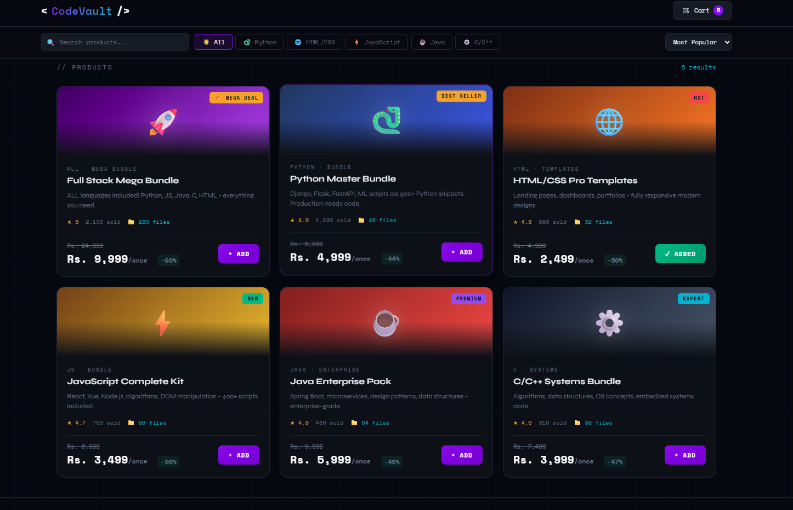

# CodeVault 🛒💻
> **Next-Generation Source Code & Digital Assets Marketplace**

Welcome to **CodeVault**, a robust web-based platform tailored for developers, designers, and tech creators to seamlessly buy, sell, and showcase web templates, source code scripts, and software assets.

---

## 📸 Visual Overview & Demo

### 🖼️ Interface Preview


### 🎥 Live Demo Preview
<!-- Convert your mp4 to a gif for inline preview -->


<!-- Alternative: If you host your video online (e.g., YouTube), use the line below -->
<!-- [](YOUR_VIDEO_LINK_HERE) -->

---

## ✨ Core Highlights

* 🔐 **User Authentication:** Secure user registration, password management, and session control built with PHP.
* 🛍️ **Interactive Marketplace:** Explore, filter, and search through curated code templates and digital components.
* 🛒 **Smart Shopping Cart:** Smooth add-to-cart functionality and efficient checkout workflow.
* 💼 **Creator Dashboard:** Comprehensive panel for sellers to publish and manage their source code listings.
* 📱 **Adaptive Design:** Fully responsive UI engineered for seamless viewing across smartphones, tablets, and desktops.

---

## 🛠️ Technology Stack

| Layer | Technology |
| :--- | :--- |
| **Frontend** | HTML5, CSS3, JavaScript (ES6+) |
| **Backend** | PHP |
| **Database** | MySQL |
| **Styling** | Custom CSS / Bootstrap / Tailwind CSS |
| **Tools** | Git, VS Code, XAMPP / WAMP |

---

## 🚀 Quick Start Guide

### 1. Clone Repository
```bash
git clone [https://github.com/diloshan-dev/code-marketplace-php.git](https://github.com/diloshan-dev/code-marketplace-php.git)
